## Notes for beginners

- **A few short cuts:**
  - G - Toggle game mode
  - ctrl + 1 (a number) - book a bookmark [A setted sence view]
  - 1 (the same number ↑) - retreive bookmark
  - F - focus on selected object
  - Ctrl + F (selected multiple objects in scene) - focus on the average viewport on selected objects 
  - Alt + Mouse dragging - duplicate  
  - ctrl + G - Group
  - ctrl + shift + mouse button = lock camera to the selected object but could move the object
  - ` (contorl tilde key) - change between world and local coordinate system
  
- **Migrate assets between several projects** (*Assets panel - Assets action - Migrate*)
- **Abmient light** - skylight
- Disable "SkyShpere" when rotating the directional light (change the position of the sun). After it updated, re-enable "SkySphere" and click refresh material (*Detial panel - default*)
- **Actor**: is a kind of container like levels 

***
- **Show Hidden Properties**: Could use to show detail properties **during play mode**
- **Compare details**: Multiple detail panels and lock a detail panel;
- **Property matrix** could see or change common attributes between objects
- Could **asign colors to folders**
- *View Options -> Thumbnail Edit Mode* - could **edit objects like models in the content browser panel**.
- **Collections**: Local Short cuts of assets (Also could save a search result to a collection)
- Settings below *Settings -> Scalability* **only change setting in the editor view** rather than the final product.
- *Project setting -> Project -> Maps & Modes* - Change the **play modes** of current project.
- **kill z**: The vertical axis value that the editor will destory objects below the kill z value.

***
- Folders including **.vs** & **Binaries** could be deleted when trying to save space. Also, when some weird problems came up, it is an option to delete the **Binaries** folder to reset the project back to scratch.
- DDC - [The Drive Data Cache](https://docs.unrealengine.com/en-US/ProductionPipelines/DerivedDataCache/index.html): Stores the versions of assets for the target Unreal platforms;
  - Is possible to customized DDC in a shared folder so that other people would not need to re-generated it.

***
- Textures size needs to be power of 2 so that Unreal engine will generate MidMaps for LOD.
- Embedded alpha VS Seperate alpha : 
  - Unreal Engine didn't compressed the alpha pass for textures. 
  - Seperate Alpha will allow to control Alpha seperately. (Like control size)
  
- 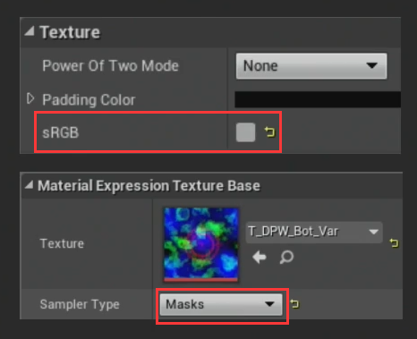 When **sRGB is unchecked**, sampler type needs to be **Masks**. Because Masks controlled the display area and shouldn't be gamma correction.
- 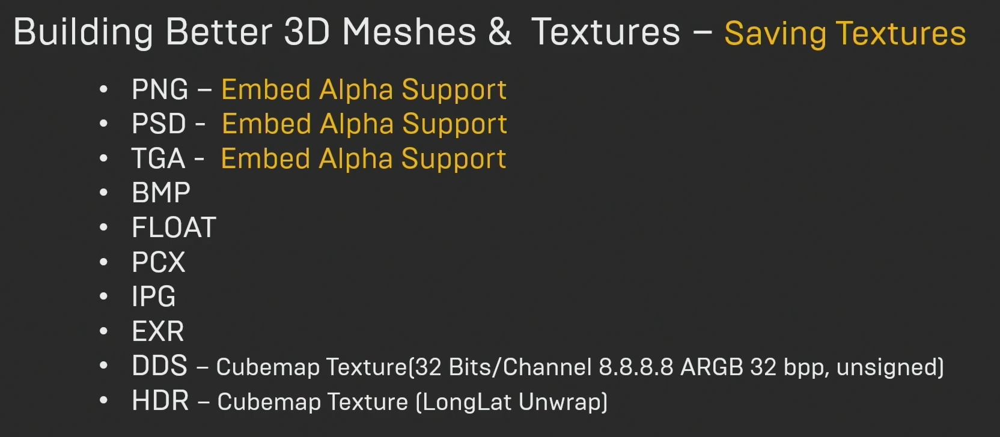
-  MidMap filtering - solve shimmering by adjust Detail -> LOD -> MipMap and choose sharpen or blur.
- Texture Group 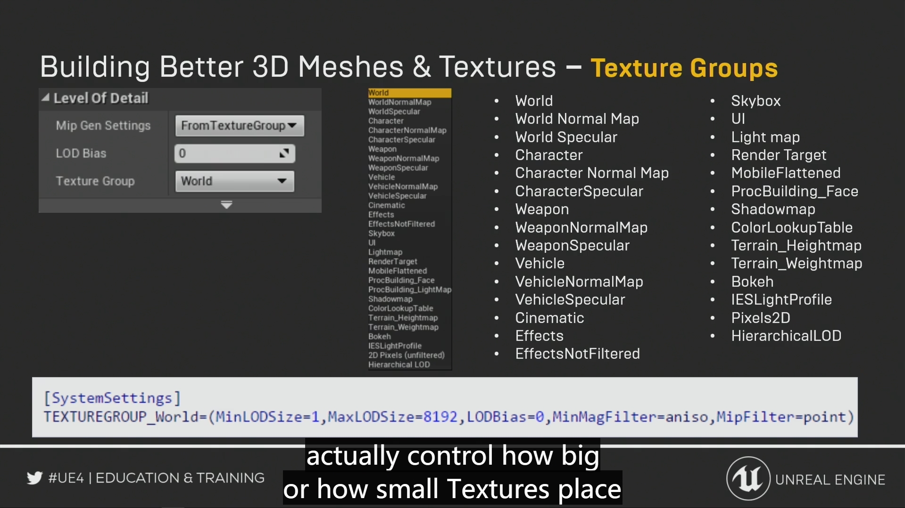 

***
- Slides:
- 1 Unreal Unit = 1 Centimeter (Make DCC software are set [*Customized -> Units Setup -> System Unit Setup -> 1 Unit = 1 Cetermiters*])
- Light map UV of a model needs to on **0-1 UV space**.
  - 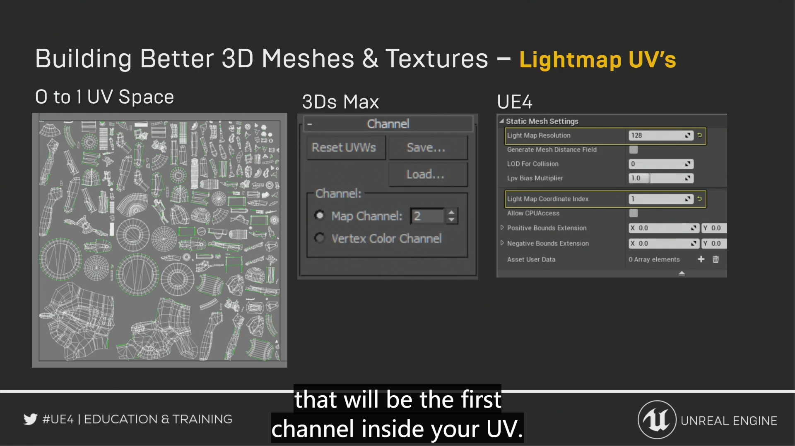  
  - 3D Max UV channel setting needs to be **Chanel 2** [Count start from 1]
  - Unreal Light Map Index needs to be **1** [Count start from 0]

- Auto generate collision for organic models: *Static Mesh -> Convex Decomposi -> Apply*
- Limiting Overdraw : Reduce overdraw (transparent dead areas) in textures 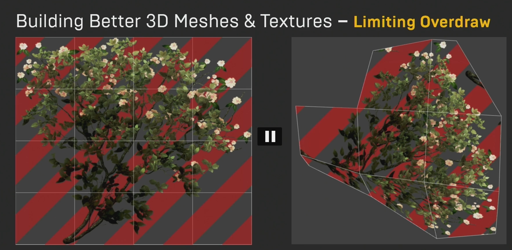

- Auto Re-Import - Could track a shared file so that be part of source control 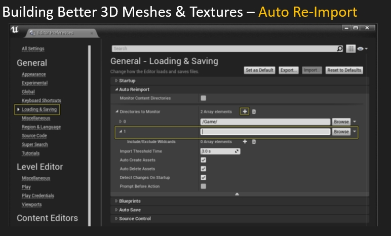

- Texture needs to be converted to paramter in order to be controlled at Material.
- 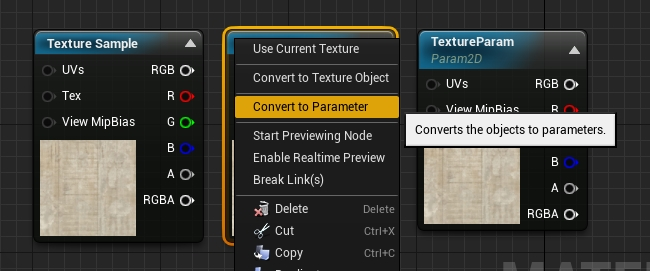

- A glass exampple 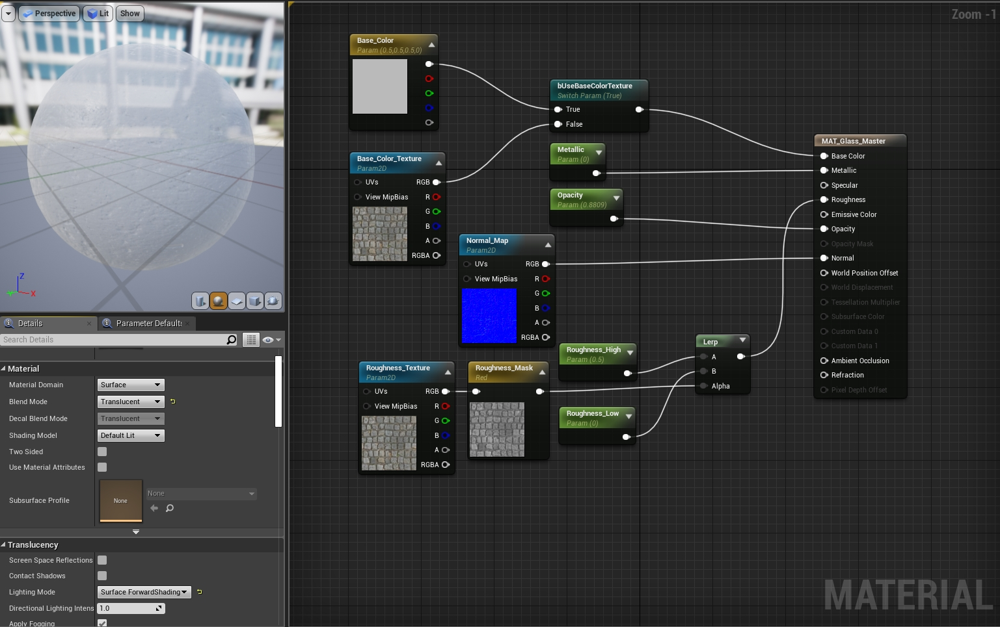
- **Material Function** - Allows to share a particular piece of material code
- Similar to a customized packaged function that could be used in different material instances.
  
  ***
- Texture streaming is used to stream LODs in and out as our camara gets further or closer to our level.
  - Use "~" keycode and type r.streaming.PoolSize = [a number]
  - Set a texture will guarantee the highest resolution but with large performance cost.

- Selected Objects in the scene and "ctrl+c" will copy the transformation infos of this object. So if the objects are deleted, "ctrl+v" will recover all the objects before deleting.
- HLOD - Merge a bunch of actors inside the level not programmally.
  - Enable *WorldSettings -> LOD System -> Hierarchical LODSetup*
  - *Window -> Hierarchical LOD Outliner* Generate Clusters
  - It will group meshes at similar detail level (e.g. 30 ~ 40 meshes) and when display them, HLOD will group them into 2 ~ 3 meshes with 2~3 materials to reduce costs.
***
## Lighting
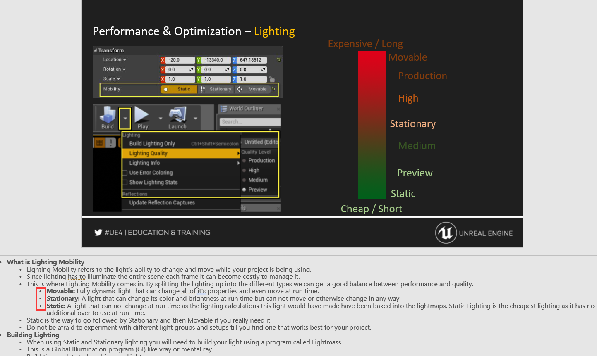
  - This is where Lighting Mobility comes in. By splitting the lighting up into the different types we can get a good balance between performance and quality.
    - **Movable**: Fully dynamic light that can change all of it's properties and even move at run time.
    - **Stationary**: A light that can change its **color** and **brightness** at run time but **can not move** or otherwise change in any way. 
    - **Static**: A light that can not change at run time as the lighting calculations this light would have made have been baked into the lightmaps. Static Lighting is the cheapest lighting as it has no additional over to use at run time.
## Shadow
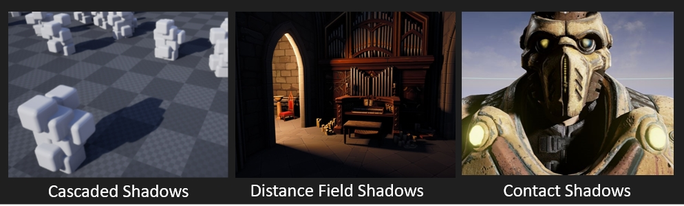
- **Cascading Shadow Maps**: Blending between dynamic shadow and static shadow based on distance. (Only works for directional lights)
- **Distance Fields Shadow**: This feature requires the project setting, Generate Mesh Distance Fields be in enabled in project settings/ Edit > Project Settings > Lighting > Generate Mesh Distance Fields. (Only works for point lights) **(Excellent quality but extraordinary expensive)**
- **Contact Shadows**: Done in screen space; For small and detailed shadow; Don't overdo with contact shadow length (Not always better when get closer to 1)(Very expensive)

## Lightmass Volume
- Lightmass importance Volume: Drag only one volumn in the level. generate samples around the scene so that when dynamic objects moves, their color will be similar to the nearest sample.
  - All levels that are going to need one of these that is scaled to the size of the useable level area. This will make sure that no photons are scattered outside of the volume making light builds go faster.
- Lightmass Character Indirect Detail Volume: This volume makes sure that any dynamic object, or objects that move around, will have the same / similar indirect lighting applied to them that matches the area they are standing in. (Elevator area where there might not be any geometry)

## Reflection
- Sphere Reflection Capture is the cheapest reflection
- Box Reflection Capture is useful in specific situation like hallway which will generate nice reflection in the corner.
- Planar Reflection is the highest quality reflection. (Copy all the meshes and materials and turn them upside down); Need to open in project setting.
  - 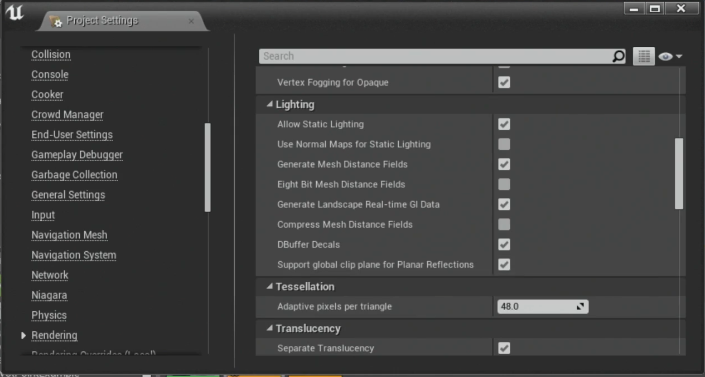

- Increase Reflection Quality:
  - 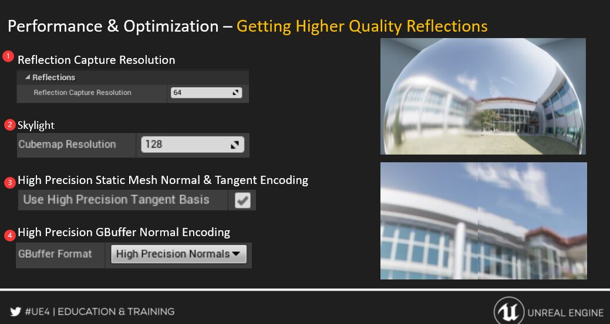

***
- Display Draw Call info
  - 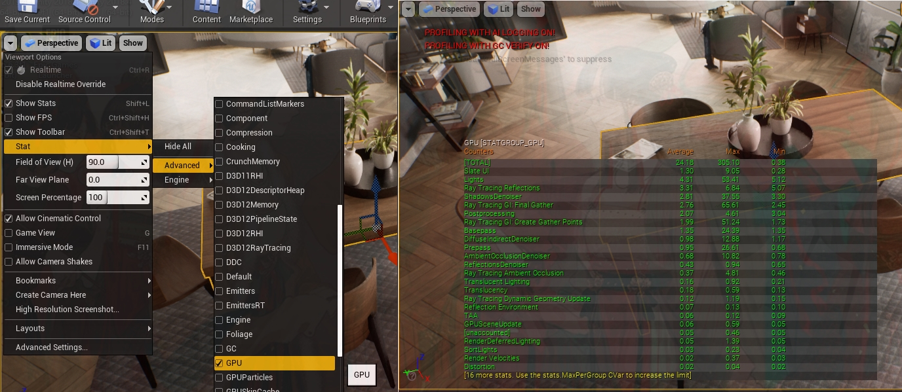